<div align="center">
  
  
  <h1>PalJS - Your Prisma GraphQL Toolkit</h1>
  
  <p><strong>A comprehensive toolkit for building modern GraphQL APIs with Prisma</strong></p>
  
  <p>
    <a href="https://www.npmjs.com/org/paljs"></a>
    <a href="https://github.com/paljs/prisma-tools/blob/main/LICENSE"></a>
    <a href="https://github.com/paljs/prisma-tools/stargazers"></a>
    <a href="https://discord.gg/X7yWXrM"></a>
  </p>
</div>

## Table of Contents

- [Introduction](#introduction)
- [Installation](#installation)
- [Usage](#usage)
- [Features](#features)
- [Configuration](#configuration)
- [License](#license)

---

# Introduction

PalJS is a powerful toolkit that accelerates GraphQL API development with Prisma. It provides code generation, admin interfaces, query optimization, and project scaffolding tools that let you build production-ready GraphQL APIs in minutes, not hours.

## Why Choose PalJS?

- **⏰ Rapid Development**: Go from Prisma schema to production API in minutes
- **🛡️ Enterprise Ready**: Built with type safety, security, and scalability in mind
- **🔌 Framework Agnostic**: Works with Apollo Server, Express, Next.js, and more
- **📚 Well Documented**: Comprehensive documentation and examples for every package
- **🌍 Active Community**: Join thousands of developers building with PalJS

## Packages

PalJS is organized as a monorepo with focused packages for different aspects of GraphQL development:

### Core Development Tools

<table>
  <tr>
    <td><strong><a href="./packages/cli">@paljs/cli</a></strong></td>
    <td>Command-line interface for project management and code generation</td>
    <td><a href="./packages/cli/README.md">📖 Docs</a></td>
  </tr>
  <tr>
    <td><strong><a href="./packages/generator">@paljs/generator</a></strong></td>
    <td>Powerful code generation engine for GraphQL schemas, resolvers, and types</td>
    <td><a href="./packages/generator/README.md">📖 Docs</a></td>
  </tr>
  <tr>
    <td><strong><a href="./packages/create">@paljs/create</a></strong></td>
    <td>Project scaffolding with templates for multiple frameworks and architectures</td>
    <td><a href="./packages/create/README.md">📖 Docs</a></td>
  </tr>
</table>

### GraphQL Integration

<table>
  <tr>
    <td><strong><a href="./packages/nexus">@paljs/nexus</a></strong></td>
    <td>Nexus plugin for Prisma integration with automatic field selection and admin schema</td>
    <td><a href="./packages/nexus/README.md">📖 Docs</a></td>
  </tr>
  <tr>
    <td><strong><a href="./packages/plugins">@paljs/plugins</a></strong></td>
    <td>GraphQL plugins for query optimization, field selection, and SDL generation</td>
    <td><a href="./packages/plugins/README.md">📖 Docs</a></td>
  </tr>
</table>

### UI Components

<table>
  <tr>
    <td><strong><a href="./packages/admin">@paljs/admin</a></strong></td>
    <td>React admin UI components with Tailwind CSS, forms, tables, and CRUD operations</td>
    <td><a href="./packages/admin/README.md">📖 Docs</a></td>
  </tr>
</table>

### Schema & Utilities

<table>
  <tr>
    <td><strong><a href="./packages/schema">@paljs/schema</a></strong></td>
    <td>Prisma schema manipulation, conversion tools, and TypeScript generation</td>
    <td><a href="./packages/schema/README.md">📖 Docs</a></td>
  </tr>
  <tr>
    <td><strong><a href="./packages/utils">@paljs/utils</a></strong></td>
    <td>Common utilities for DMMF processing, schema validation, and helper functions</td>
    <td><a href="./packages/utils/README.md">📖 Docs</a></td>
  </tr>
  <tr>
    <td><strong><a href="./packages/types">@paljs/types</a></strong></td>
    <td>Comprehensive TypeScript type definitions for the entire PalJS ecosystem</td>
    <td><a href="./packages/types/README.md">📖 Docs</a></td>
  </tr>
  <tr>
    <td><strong><a href="./packages/display">@paljs/display</a></strong></td>
    <td>Styled console output, progress indicators, and logging utilities for CLI tools</td>
    <td><a href="./packages/display/README.md">📖 Docs</a></td>
  </tr>
</table>

## Architecture

PalJS follows a modular architecture that supports different GraphQL patterns:

```mermaid
graph TB
    CLI[📱 PalJS CLI] --> Create[🚀 Project Creation]
    CLI --> Generate[⚡ Code Generation]

    Create --> Templates[📋 Templates]
    Templates --> NextJS[Next.js + GraphQL]
    Templates --> Apollo[Apollo Server]
    Templates --> Modules[GraphQL Modules]

    Generate --> Schema[🔧 Schema Processing]
    Generate --> Nexus[🎯 Nexus Integration]
    Generate --> SDL[📝 SDL Generation]
    Generate --> Admin[🎨 Admin UI]

    Schema --> Utils[🛠️ Utilities]
    Schema --> Types[📊 Type Definitions]

    Nexus --> Plugins[🔌 GraphQL Plugins]
    Plugins --> Optimization[⚡ Query Optimization]
```



---

# Installation

Choose one of the following installation methods:

## Global Installation (Recommended)

```bash
# Install PalJS CLI globally to use the 'pal' command
npm install -g @paljs/cli

# After global installation, the 'pal' binary is available system-wide
pal --help
```

## Use with npx (No Installation Required)

```bash
# Use npx to run commands without global installation
npx @paljs/cli --help
```

---

# Usage

## Quick Start

### Create Your First Project

#### Using Global Installation (`pal` command)

```bash
# Create a new full-stack project
pal create my-graphql-app

# Choose your preferred setup:
# ✔ Project template: full-stack-nextjs
# ✔ UI framework: Tailwind CSS + PrismaAdmin UI
# ✔ Package manager: yarn
# ✔ Initialize git: yes

cd my-graphql-app
yarn dev
```

#### Using npx (Alternative Method)

```bash
# Create a new full-stack project without global installation
npx @paljs/cli create my-graphql-app

# Same interactive setup process follows
cd my-graphql-app
yarn dev
```

### Generate GraphQL API

#### Using Global Installation

```bash
# After defining your Prisma schema
pal generate

# Generates:
# ✅ GraphQL schema with all CRUD operations
# ✅ Type-safe resolvers
# ✅ Admin interface pages
# ✅ Query optimization utilities
```

#### Using npx

```bash
# After defining your Prisma schema
npx @paljs/cli generate

# Same generated output
```

## 5-Minute Setup

1. **Install PalJS CLI**

   ```bash
   npm install -g @paljs/cli
   ```

2. **Create a new project**

   ```bash
   pal create my-app --example full-stack-nextjs --framework "Tailwind CSS + PrismaAdmin UI"
   ```

3. **Define your data model**

   ```prisma
   // prisma/schema.prisma
   model User {
     id    Int     @id @default(autoincrement())
     email String  @unique
     name  String?
     posts Post[]
   }
   
   model Post {
     id        Int     @id @default(autoincrement())
     title     String
     content   String?
     published Boolean @default(false)
     author    User    @relation(fields: [authorId], references: [id])
     authorId  Int
   }
   ```

4. **Generate GraphQL API**

   ```bash
   cd my-app
   pal generate
   ```

5. **Start developing**
   ```bash
   npm run dev
   ```

## Choose Your Architecture

### Nexus Schema-First

```bash
pal create my-nexus-api --example apollo-nexus-schema
```

Perfect for: Type-safe GraphQL with excellent TypeScript integration

### SDL-First

```bash
pal create my-sdl-api --example apollo-sdl-first
```

Perfect for: Schema-first development with flexible resolver patterns

### GraphQL Modules

```bash
pal create my-modular-api --example graphql-modules
```

Perfect for: Large, scalable applications with modular architecture

### Full-Stack Next.js

```bash
pal create my-fullstack-app --example full-stack-nextjs
```

Perfect for: Complete web applications with admin interfaces

## Use Cases

### Rapid Prototyping

- Generate complete GraphQL APIs from Prisma schemas
- Instant admin interfaces for data management
- Built-in authentication and authorization patterns

### Enterprise Applications

- Multi-schema support for microservices
- Type-safe code generation
- Scalable GraphQL architectures

### Learning & Education

- Best practice templates and examples
- Comprehensive documentation
- Community support and tutorials

### API Modernization

- Migrate REST APIs to GraphQL
- Add admin interfaces to existing databases
- Optimize query performance automatically

## Migration & Upgrading

### From v7 to v8

```bash
# Update all PalJS packages
npm update @paljs/cli @paljs/generator @paljs/nexus

# Regenerate with latest templates
pal generate --force
```

### Database Migrations

```bash
# Generate Prisma migration
npx prisma migrate dev

# Regenerate GraphQL schema
pal generate
```

---

# Features

## Features

- 🔥 **Instant CRUD Generation** - Auto-generate complete GraphQL schemas, resolvers, and mutations
- 🎨 **Admin UI Components** - Ready-to-use React admin interfaces with full CRUD operations
- ⚡ **Query Optimization** - Automatic field selection and query optimization for better performance
- 🏗️ **Project Scaffolding** - Create full-stack applications with modern frameworks and best practices
- 🎯 **Type Safety** - Full TypeScript support across all packages and generated code
- 🔧 **Multiple Architectures** - Support for Nexus, SDL-first, and GraphQL Modules approaches

## Performance & Best Practices

### Query Optimization

- Automatic field selection based on GraphQL queries
- Reduced database load with smart relationship loading
- Built-in query complexity analysis

### Security

- Input validation and sanitization
- Rate limiting and query depth limiting
- Secure authentication patterns

### Monitoring

- Built-in performance metrics
- Error tracking and logging
- Development and production optimizations

## Community & Support

### Resources

- **[Documentation](https://paljs.com)** - Comprehensive guides and API references
- **[Examples](./packages/create/examples)** - Real-world project templates
- **[Blog](https://paljs.com/blog)** - Tutorials, tips, and best practices

### Community

- **[Discord](https://discord.gg/X7yWXrM)** - Join our community for help and discussions
- **[GitHub Issues](https://github.com/paljs/prisma-tools/issues)** - Report bugs and request features
- **[Discussions](https://github.com/paljs/prisma-tools/discussions)** - Ask questions and share ideas

### Contributing

We welcome contributions! See our [Contributing Guide](./CONTRIBUTING.md) for details.

### Professional Support

Need enterprise support? Contact us at **hello@paljs.com**

---

# Configuration

## Basic Configuration (`paljs.config.js`)

```javascript
module.exports = {
  schema: './prisma/schema.prisma',
  backend: {
    generator: 'nexus', // 'nexus' | 'sdl' | 'graphql-modules'
    output: './src/graphql',
    excludeFields: ['password', 'hash'],
    excludeModels: [{ name: 'Log', queries: true, mutations: false }],
  },
  frontend: {
    admin: {
      models: ['User', 'Post', 'Category'],
      output: './src/admin/pages',
    },
  },
};
```

## Multi-Schema Configuration

```javascript
module.exports = {
  multiSchema: true,
  schemas: {
    user: {
      schema: './prisma/user.prisma',
      backend: { generator: 'nexus', output: './src/graphql/user' },
    },
    blog: {
      schema: './prisma/blog.prisma',
      backend: { generator: 'sdl', output: './src/graphql/blog' },
    },
  },
};
```

---

# License

This project is licensed under the MIT License - see the [LICENSE](LICENSE) file for details.

---

<div align="center">
  <p><strong>Built with ❤️ by the PalJS team</strong></p>
  <p>
    <a href="https://github.com/paljs/prisma-tools">⭐ Star on GitHub</a> •
    <a href="https://discord.gg/X7yWXrM">💬 Join Discord</a> •
    <a href="https://paljs.com">📚 Read Docs</a>
  </p>
</div>
