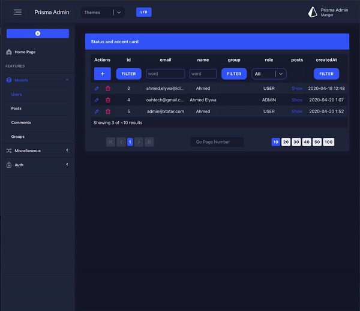

### Admin pages for Prisma project

Admin pages for prisma project db with [`@prisma-tools/admin`](https://github.com/AhmedElywa/prisma-tools/tree/master/packages/admin) tool to generate pages and apollo (queries and mutations) hooks and `schema.json` to custom your models



## How to use

### 1. Download example & install dependencies

Clone this repository:

```shell script
git clone https://github.com/AhmedElywa/prisma-tools.git
```

Install npm dependencies:

```shell script
cd examples/admin-gatsbyjs/
```

```shell script
yarn i-all
```

Start service

```shell script
yarn generate
yarn start
```

Navigate to [http://localhost:8000](http://localhost:8000/) in your browser to explore admin pages

This admin ui template built on [oah-ui](https://oah-ui.oahtech.io/getting-started)

### Have questions?

Didn't find something here? Look through the [issues](https://github.com/AhmedElywa/prisma-tools/issues) or simply drop us a line at <ahmed.elywa@icloud.com>.

## Like my tool give me star
